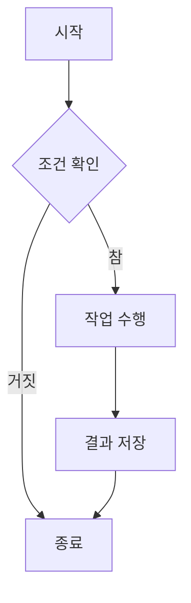
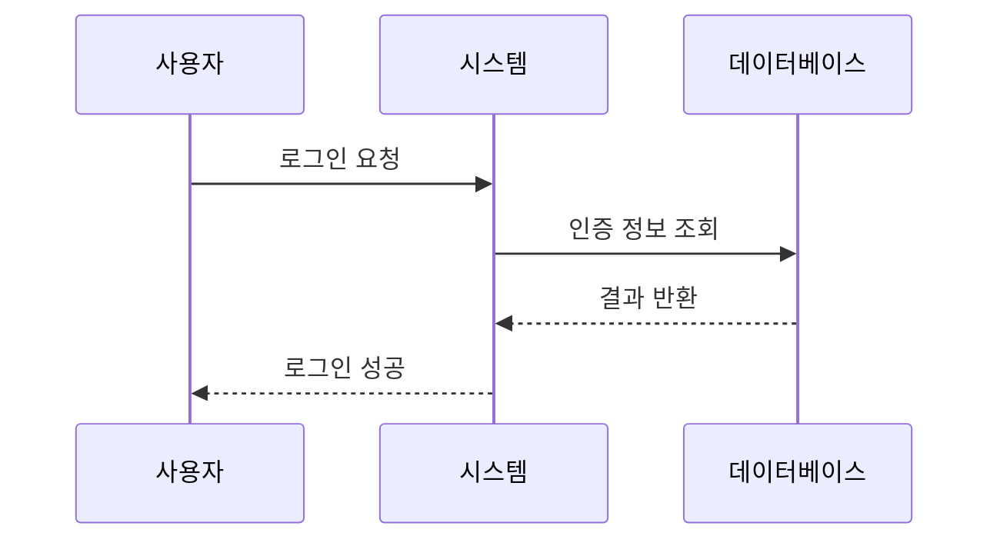
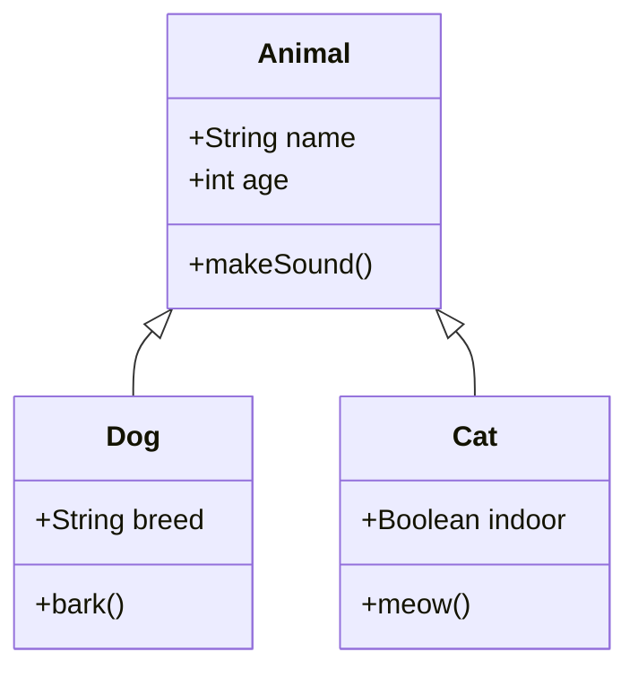

## 수식 예제

인라인 수식: 피타고라스 정리는 $$a^2 + b^2 = c^2$$로 표현됩니다.

블록 수식:

$$
\int_{-\infty}^{\infty} e^{-x^2} dx = \sqrt{\pi}
$$

행렬:

$$
\begin{bmatrix}
a & b \\
c & d
\end{bmatrix}
\begin{bmatrix}
x \\
y
\end{bmatrix}
=
\begin{bmatrix}
ax + by \\
cx + dy
\end{bmatrix}
$$

## Mermaid 그래프 예제

### 플로우차트

### 시퀀스 다이어그램

### 클래스 다이어그램

## 복잡한 수식

오일러 공식:

$$
e^{i\pi} + 1 = 0
$$

미분방정식:

$$
\frac{dy}{dx} = ky \implies y = Ce^{kx}
$$

합 표기:

$$
\sum_{n=1}^{\infty} \frac{1}{n^2} = \frac{\pi^2}{6}
$$

## 마무리

이 포스트는 al-folio 테마의 수식과 그래프 렌더링 기능을 테스트하기 위한 예제입니다.
